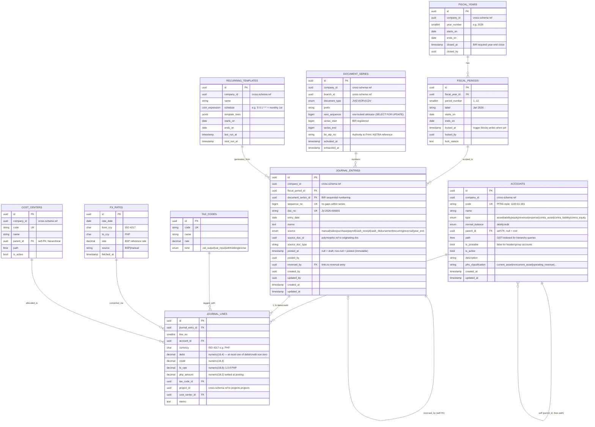

# Accounting Schema — `accounting.*`

**Purpose:** Chart of Accounts, journal entries, fiscal years/periods, FX rates, cost centers. The core of the BIR-compliant general ledger.
**Owned by role:** `pha_app`
**BIR alignment:** RR 9-2009 / RR 11-2025 (CAS), PFRS for SMEs / Full PFRS

---

## ERD



---

## Tables (summary)

| Table | Rows (est.) | Critical indexes | Notes |
|---|---|---|---|
| `fiscal_years` | ~10 | PK, UK(company_id, year_number) | One per fiscal year; `closed_at` for year-end close |
| `fiscal_periods` | 12 × years | PK, UK(fiscal_year_id, period_number), idx(locked_at) | Monthly periods; `locked_at` triggers immutability |
| `accounts` | 200–2,000 | PK, UK(company_id, code), GiST(path) | PFRS-aligned hierarchical CoA |
| `journal_entries` | ~10k/month | PK, UK(doc_no), idx(fiscal_period_id, entry_date), idx(source, source_doc_id) | Partition by RANGE(entry_date) yearly when > 1M rows |
| `journal_lines` | ~30k/month | PK, idx(journal_entry_id), idx(account_id, entry_date) | Partition by RANGE(created_at) monthly when > 10M rows |
| `document_series` | ~10 | PK, UK(company_id, branch_id, document_type, prefix) | Row-locked allocator |
| `tax_codes` | ~30 | PK, UK(code) | Seeded from BIR; versioned via effectivity dates |
| `fx_rates` | daily, ~10 currencies | PK, UK(rate_date, from_ccy, to_ccy), idx(rate_date desc) | BSP scraper job populates daily |
| `cost_centers` | ~50 | PK, UK(company_id, code), GiST(path) | Optional dimensional analysis |
| `recurring_templates` | ~50 | PK, idx(next_run_at) | Scheduler picks up due templates |

---

## Triggers (BIR-critical)

### 1. Reject writes to locked periods
```sql
CREATE OR REPLACE FUNCTION accounting.reject_locked_period_writes() RETURNS trigger AS $$
DECLARE _locked_at timestamptz;
BEGIN
    SELECT fp.locked_at INTO _locked_at
      FROM accounting.fiscal_periods fp
     WHERE fp.id = NEW.fiscal_period_id;
    IF _locked_at IS NOT NULL THEN
        RAISE EXCEPTION 'Fiscal period % is locked since %', NEW.fiscal_period_id, _locked_at
            USING ERRCODE = 'P0001';
    END IF;
    RETURN NEW;
END $$ LANGUAGE plpgsql;

CREATE TRIGGER reject_locked_journal_writes
    BEFORE INSERT OR UPDATE ON accounting.journal_entries
    FOR EACH ROW EXECUTE FUNCTION accounting.reject_locked_period_writes();
```

### 2. Double-entry balance enforcement (deferred)
```sql
ALTER TABLE accounting.journal_lines
    ADD CONSTRAINT lines_balance_per_entry CHECK (
        debit >= 0 AND credit >= 0 AND NOT (debit > 0 AND credit > 0)
    );

-- Per-entry SUM check via deferred constraint trigger, evaluated at COMMIT
CREATE CONSTRAINT TRIGGER journal_balance_check
    AFTER INSERT OR UPDATE OR DELETE ON accounting.journal_lines
    DEFERRABLE INITIALLY DEFERRED
    FOR EACH ROW EXECUTE FUNCTION accounting.assert_balanced_entry();
```

### 3. Audit emission
```sql
CREATE TRIGGER journal_entries_audit
    AFTER INSERT OR UPDATE OF posted_at, reversed_by ON accounting.journal_entries
    FOR EACH ROW EXECUTE FUNCTION audit.write_event('JournalEntry');
```

### 4. No DELETE on posted entries
```sql
REVOKE DELETE ON accounting.journal_entries, accounting.journal_lines FROM pha_app;
-- Voiding/reversal is done via separate reversal journal entry (linked by reversed_by)
```

---

## ltree Hierarchy Example

```
1                       (Assets — root)
├─ 1.1100               (Current Assets)
│  ├─ 1.1100.01         (Cash and Cash Equivalents)
│  │  ├─ 1.1100.01.001  (Petty Cash Fund)
│  │  └─ 1.1100.01.002  (Cash in Bank — BPI)
│  └─ 1.1100.02         (Accounts Receivable)
└─ 1.1200               (Non-current Assets)
```

Query "all current assets and descendants":
```sql
SELECT * FROM accounting.accounts WHERE path <@ '1.1100';
```

---

## Cross-Schema References

**Outbound (this schema → others):**
- `journal_lines.project_id` → `projects.projects.id`
- `journal_entries.source_doc_id` → various (sales.invoices, procurement.vendor_bills, payroll.payroll_runs)

**Inbound (others → this schema):**
- `sales.invoices` → posts to `journal_entries` (1:1)
- `procurement.vendor_bills` → posts to `journal_entries` (1:1)
- `payroll.payroll_runs` → posts to `journal_entries` (1:1 per run)
- `inventory.stock_movements` → posts revaluation entries when costing changes

All references are UUID logical FKs without DB constraints across schemas.
