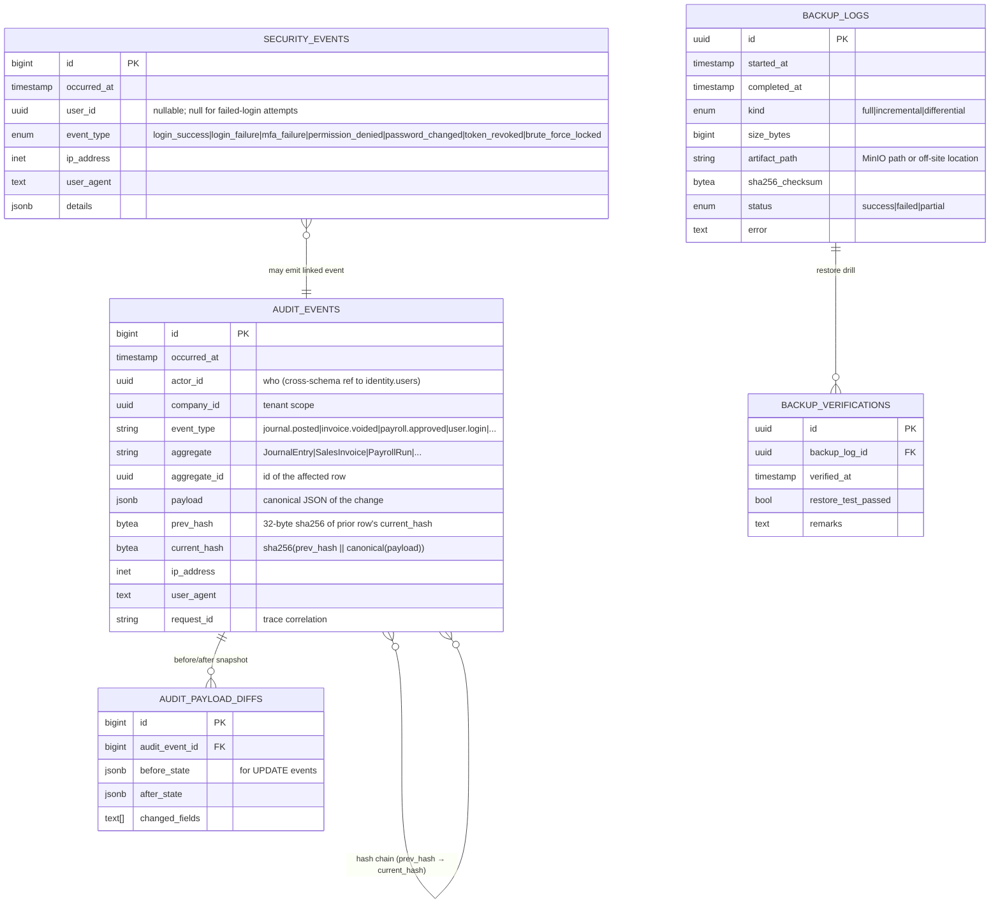

# Audit Schema — `audit.*`

**Purpose:** Hash-chained, append-only event log of every consequential change in the system. **Required for BIR CAS Permit-to-Use** (RR 9-2009 §6.2).
**Owned by role:** `pha_audit` (INSERT-only). UPDATE/DELETE are **revoked at the database level** for everyone, including superusers in normal operation.
**Read access:** `pha_reader` (used by Auditor role for read-only investigation).

---

## ERD



---

## Table Specifications

### `audit.events` — the immutable log

```sql
CREATE TABLE audit.events (
    id           bigserial PRIMARY KEY,
    occurred_at  timestamptz NOT NULL DEFAULT now(),
    actor_id     uuid,
    company_id   uuid NOT NULL,
    event_type   text NOT NULL,
    aggregate    text NOT NULL,
    aggregate_id uuid NOT NULL,
    payload      jsonb NOT NULL,
    prev_hash    bytea,
    current_hash bytea NOT NULL,
    ip_address   inet,
    user_agent   text,
    request_id   text
);

CREATE INDEX events_company_time   ON audit.events (company_id, occurred_at);
CREATE INDEX events_aggregate      ON audit.events (aggregate, aggregate_id);
CREATE INDEX events_event_type     ON audit.events (event_type, occurred_at);
CREATE INDEX events_actor          ON audit.events (actor_id, occurred_at);
CREATE INDEX events_payload_gin    ON audit.events USING gin (payload jsonb_path_ops);
```

**Partitioning:** `RANGE (occurred_at)` monthly once row count > 10M, with automatic partition creation in a Horizon job.

---

## Hash Chain Mechanism

```sql
CREATE OR REPLACE FUNCTION audit.enforce_chain() RETURNS trigger AS $$
DECLARE last_hash bytea;
BEGIN
    -- Atomic: SELECT FOR UPDATE on the latest row prevents concurrent insertion
    -- from breaking the chain. Lock granularity is per-company.
    SELECT current_hash INTO last_hash
      FROM audit.events
     WHERE company_id = NEW.company_id
     ORDER BY id DESC
     LIMIT 1
     FOR UPDATE;

    NEW.prev_hash    := last_hash;  -- NULL for the very first row
    NEW.current_hash := digest(
        coalesce(last_hash, ''::bytea) || convert_to(NEW.payload::text, 'UTF8'),
        'sha256'
    );
    RETURN NEW;
END $$ LANGUAGE plpgsql;

CREATE TRIGGER audit_events_chain
    BEFORE INSERT ON audit.events
    FOR EACH ROW EXECUTE FUNCTION audit.enforce_chain();
```

### Tamper detection

Daily Horizon job `VerifyAuditChainJob` walks the chain in order, recomputes each hash, and raises a CRITICAL alert (PagerDuty/email) on any mismatch. Auditors can run the same verification on demand:

```sql
WITH chain AS (
    SELECT id, prev_hash, current_hash, payload,
           LAG(current_hash) OVER (PARTITION BY company_id ORDER BY id) AS expected_prev
    FROM audit.events
)
SELECT id FROM chain
WHERE prev_hash IS DISTINCT FROM expected_prev
   OR current_hash != digest(coalesce(prev_hash, ''::bytea) || convert_to(payload::text, 'UTF8'), 'sha256');
```

---

## Append-Only Enforcement

```sql
-- Block UPDATE
CREATE OR REPLACE FUNCTION audit.block_mutation() RETURNS trigger AS $$
BEGIN
    RAISE EXCEPTION 'audit.events is append-only (BIR CAS RR 9-2009 §6.2)'
        USING ERRCODE = 'P0001';
END $$ LANGUAGE plpgsql;

CREATE TRIGGER audit_events_no_update BEFORE UPDATE ON audit.events
    FOR EACH ROW EXECUTE FUNCTION audit.block_mutation();
CREATE TRIGGER audit_events_no_delete BEFORE DELETE ON audit.events
    FOR EACH ROW EXECUTE FUNCTION audit.block_mutation();
CREATE TRIGGER audit_events_no_truncate BEFORE TRUNCATE ON audit.events
    EXECUTE FUNCTION audit.block_mutation();

-- Role-level: pha_app gets INSERT only via pha_audit
GRANT INSERT, SELECT ON audit.events TO pha_audit;
GRANT SELECT ON audit.events TO pha_reader;
REVOKE UPDATE, DELETE, TRUNCATE ON audit.events FROM PUBLIC;
```

The application connects as `pha_app` (no audit access), and every audit-emitting trigger uses `SECURITY DEFINER` on a function owned by `pha_audit` to perform the insert.

---

## Event Types (Catalog)

| Aggregate | Events |
|---|---|
| `User` | `created`, `updated`, `disabled`, `password_changed`, `mfa_enabled`, `mfa_disabled` |
| `JournalEntry` | `posted`, `reversed`, `attached_doc` |
| `FiscalPeriod` | `locked`, `unlocked` (rare; requires Auditor + Admin co-approval) |
| `SalesInvoice` | `issued`, `voided`, `eis_acknowledged`, `eis_rejected` |
| `OfficialReceipt` | `issued`, `voided` |
| `VendorBill` | `posted`, `voided`, `paid` |
| `PayrollRun` | `computed`, `approved`, `paid`, `reversed` |
| `BirForm` | `generated`, `filed`, `amended` |
| `Form2307` | `issued`, `sent_to_vendor` |
| `Form2316` | `issued`, `signed` |
| `EisSubmission` | `submitted`, `acknowledged`, `rejected`, `retry` |
| `Backup` | `started`, `completed`, `verified`, `restored` |
| `Permission` | `granted`, `revoked` |

The `event_type` is `<aggregate_lowercased>.<event>` (e.g. `journalentry.posted`, `eissubmission.acknowledged`).

---

## Backup Logs (CAS Compliance)

BIR requires proof of regular backups. `audit.backup_logs` is populated by a webhook from pgBackRest after each backup run (full + incremental). `audit.backup_verifications` is filled quarterly by a restore drill into a sandbox database.

Output of `php artisan audit:backup-status` is part of the CAS PTU application package.

---

## Security Events

`audit.security_events` is a separate stream for authentication and authorization events that don't have an aggregate (e.g. failed logins). It is **not** hash-chained but is queried alongside `audit.events` for security investigations.

---

## Cross-Schema References

**Inbound (logical, by UUID):**
- `audit.events.actor_id` ← any user from `identity.users.id`
- `audit.events.aggregate_id` ← polymorphic, depending on `aggregate`

**Outbound:** none. Audit is a sink, not a source.

**Application interface:**
Modules emit audit events via the `Audit\Application\Contracts\AuditWriter` contract. Concrete implementation `EloquentAuditWriter` calls a `SECURITY DEFINER` function that owns INSERT permission on `audit.events`. Modules cannot bypass audit.
