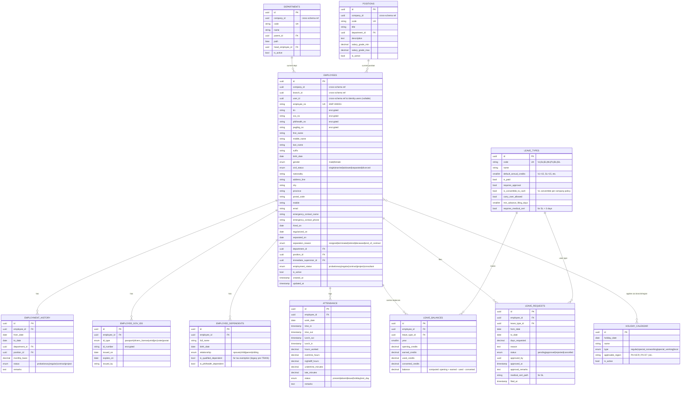

# HR Schema — `hr.*`

**Purpose:** Employees, employment history, leave management, attendance, government IDs.
**Owned by role:** `pha_app`
**Compliance:** Labor Code (PD 442), DOLE leave rules, Data Privacy Act (RA 10173) for PII handling.

---

## ERD



---

## Tables (summary)

| Table | Rows (est.) | Critical indexes | Notes |
|---|---|---|---|
| `employees` | ~500 | PK, UK(employee_no), UK(tin), idx(company_id, is_active), idx(department_id) | All gov IDs encrypted |
| `employment_history` | ~5 per employee | PK, idx(employee_id, from_date desc) | |
| `employee_gov_ids` | ~3 per employee | PK, idx(employee_id) | All ID numbers encrypted |
| `employee_dependents` | ~3 per employee | PK, idx(employee_id) | |
| `departments` | ~20 | PK, UK(company_id, code), GiST(path) | Hierarchical |
| `positions` | ~50 | PK, UK(company_id, code) | |
| `attendance` | ~150k/year (500 emp × 365 days) | PK, UK(employee_id, work_date), idx(work_date) | Partition by RANGE(work_date) yearly when > 1M |
| `leave_types` | ~10 (seeded) | PK, UK(code) | VL, SL, EL, ML (105d RA 11210), PL, BL, SIL |
| `leave_balances` | ~5k/year (employees × types) | PK, UK(employee_id, leave_type_id, year) | Computed balance via trigger |
| `leave_requests` | ~3k/year | PK, idx(employee_id, from_date), idx(status) | |
| `holiday_calendar` | ~30/year | PK, idx(holiday_date) | Updated annually from Malacañang proclamations |

---

## DOLE Statutory Leaves (Phased Implementation)

| Leave | Code | Statute | Days | Notes |
|---|---|---|---|---|
| Service Incentive Leave | SIL | Labor Code Art. 95 | 5 | Min for employees with ≥1 year service |
| Maternity Leave | ML | RA 11210 (Expanded) | 105 | + 15 if solo parent (RA 8972) |
| Paternity Leave | PL | RA 8187 | 7 | Married, first 4 deliveries |
| Solo Parent Leave | SPL | RA 8972 | 7 | Per year |
| Magna Carta for Women Special Leave | MCW | RA 9710 | 60 | Gynecological surgery |
| VAWC Leave | VAWC | RA 9262 | 10 | Women victims |

Each is a row in `leave_types` with default credits seeded per the law; company policies can extend.

---

## Triggers

```sql
-- Maintain leave_balances on leave_request approval
CREATE TRIGGER leave_request_balance_update
    AFTER UPDATE OF status ON hr.leave_requests
    FOR EACH ROW
    WHEN (NEW.status = 'approved' AND OLD.status != 'approved')
    EXECUTE FUNCTION hr.deduct_leave_balance();

-- Audit on employment changes
CREATE TRIGGER employees_audit
    AFTER INSERT OR UPDATE OR DELETE ON hr.employees
    FOR EACH ROW EXECUTE FUNCTION audit.write_event('Employee');
```

---

## Cross-Schema References

**Outbound:**
- `employees.user_id` → `identity.users.id` (link to login account if applicable)
- `employees.branch_id` → `identity.branches.id`
- `employees.company_id` → `identity.companies.id`

**Inbound:**
- `payroll.compensation_packages.employee_id` ← payroll uses HR as source of truth
- `payroll.payslips.employee_id` ←
- `projects.timesheets.employee_id` ← time tracking
