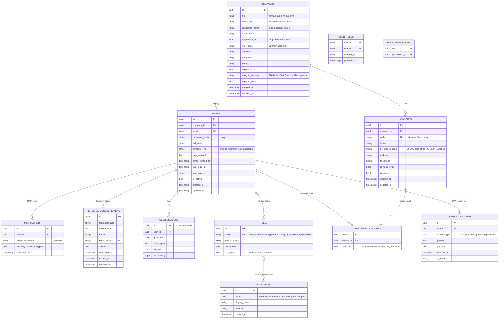

# Identity Schema — `identity.*`

**Purpose:** Companies (single tenant — one row, but designed for future multi-tenant), branches, users, roles, permissions, MFA, sessions.
**Owned by role:** `pha_app`
**Read access:** `pha_app`, `pha_reader`

---

## ERD



---

## Tables (summary)

| Table | Rows (est.) | Indexes | Notes |
|---|---|---|---|
| `companies` | 1 (single-tenant) | PK, UK(tin) | Holds BIR registration; `cas_ptu_number` populated after CAS PTU approval |
| `branches` | 1–50 | PK, UK(company_id, code), UK(company_id, bir_branch_code) | One head office + branches; document numbering scoped per branch |
| `users` | 10–500 | PK, UK(email), idx(company_id) | Sanctum token target; `email_verified_at` required before login |
| `roles` | 8 (seeded, system) | PK, UK(name) | Admin, Accountant, Approver, Auditor, Cashier, HR, Payroll, Viewer |
| `permissions` | ~200 | PK, UK(name), idx(module) | Format `module.resource.action` (e.g., `tax.form_2550m.file`) |
| `user_roles` | many | composite PK | `spatie/laravel-permission` table |
| `role_permissions` | many | composite PK | `spatie/laravel-permission` table |
| `user_branch_scopes` | many | composite PK | Row-level scoping; user only sees data for assigned branches |
| `mfa_secrets` | 1 per user | PK, UK(user_id) | TOTP via `pragmarx/google2fa`; `secret_encrypted` uses `pgcrypto` |
| `personal_access_tokens` | many | PK, UK(token_hash), idx(tokenable) | Laravel Sanctum default table |
| `user_sessions` | many | PK | Laravel session driver = `redis` in prod; this is fallback DB driver |
| `consent_records` | many | PK, idx(user_id, consent_type) | DPA (RA 10173) compliance |

---

## Triggers & Constraints

```sql
-- Email is case-insensitive (citext extension)
CREATE UNIQUE INDEX users_email_unique ON identity.users (email);

-- Audit hook: every change to users/roles/permissions writes to audit.events
CREATE TRIGGER users_audit AFTER INSERT OR UPDATE OR DELETE ON identity.users
    FOR EACH ROW EXECUTE FUNCTION audit.write_event('User');
```

---

## Seeded Roles & Permissions

| Role | Key permissions |
|---|---|
| **Admin** | All permissions; can create/disable users; can configure tax tables |
| **Accountant** | `accounting.*`, `sales.invoices.create`, `procurement.bills.create`, `tax.forms.generate` |
| **Approver** | `accounting.journals.post`, `sales.invoices.void`, `payroll.runs.approve`, `tax.forms.file` (requires MFA) |
| **Auditor** | Read-only on all financial schemas + `audit.events.read`; cannot post or modify (requires MFA) |
| **Cashier** | `sales.invoices.create`, `sales.or.issue`, `sales.pos.transact` |
| **HR** | `hr.*`, `payroll.employees.read` |
| **Payroll** | `payroll.runs.create`, `payroll.compensation.update`, `payroll.statutory.read` |
| **Viewer** | Read-only on financial reports; no transaction access |

MFA is **mandatory** for Admin, Approver, Auditor — enforced at login by middleware.

---

## Cross-Schema References (outbound)

- `identity.users.id` → referenced by virtually every schema as `created_by`, `updated_by`, `posted_by`, `approved_by`
- `identity.companies.id` → referenced by every other schema as `company_id` (tenant scope, even in single-tenant deployment)
- `identity.branches.id` → referenced by `sales.document_series`, `sales.invoices`, `procurement.purchase_orders`, `inventory.warehouses`

These references are **logical UUIDs only** — no cross-schema FK constraints. Cross-schema integrity is maintained by application-layer Contracts.
