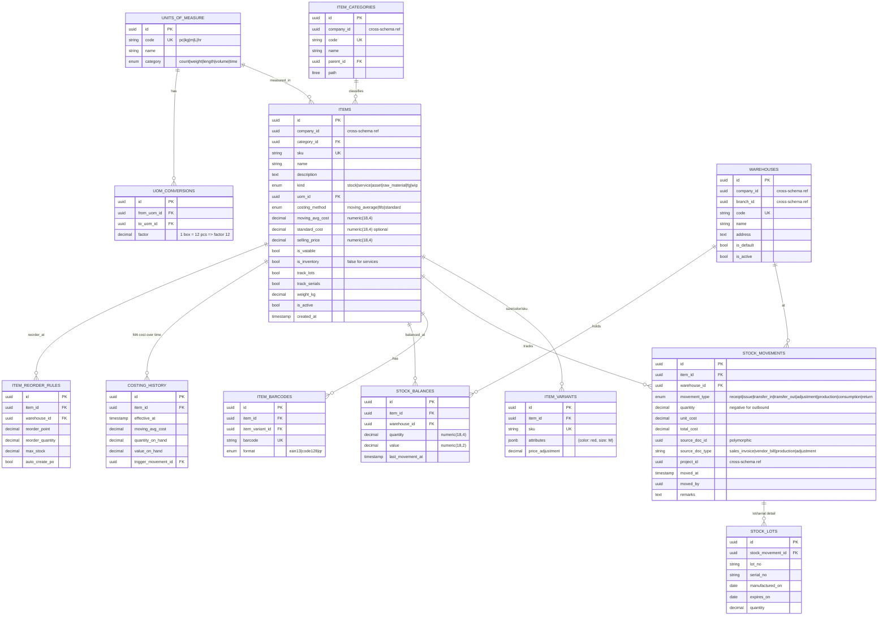

# Inventory Schema — `inventory.*`

**Purpose:** Items (products, services, raw materials, FG), warehouses, stock movements, lot/serial tracking, costing.
**Costing methods:** Moving Average (default, BIR-acceptable) and FIFO. LIFO not allowed under PFRS.
**BIR alignment:** Annual Inventory List submission (RMC 57-2015), VAT input/output on goods.

---

## ERD



---

## Tables (summary)

| Table | Rows (est.) | Critical indexes | Notes |
|---|---|---|---|
| `item_categories` | ~50 | PK, UK(company_id, code), GiST(path) | Hierarchical; supports BIR Inventory List grouping |
| `items` | ~10k | PK, UK(sku), idx(company_id, is_active), idx(category_id) | `moving_avg_cost` updated by costing engine |
| `item_variants` | ~30k | PK, UK(sku), idx(item_id) | |
| `item_barcodes` | ~30k | PK, UK(barcode) | POS scan lookup |
| `units_of_measure` | ~30 (seeded) | PK, UK(code) | |
| `uom_conversions` | ~50 | PK | Convert qty across UoMs |
| `warehouses` | ~10 | PK, UK(code), idx(company_id) | |
| `stock_balances` | items × warehouses | PK, UK(item_id, warehouse_id) | Materialized current balance for fast lookup |
| `stock_movements` | ~100k/year | PK, idx(item_id, moved_at), idx(warehouse_id, moved_at), idx(source_doc_id, source_doc_type) | Partition by RANGE(moved_at) yearly when > 1M |
| `stock_lots` | ~10k | PK, idx(stock_movement_id), idx(lot_no), idx(expires_on) where expires_on is not null | FEFO for perishables |
| `costing_history` | ~100k/year | PK, idx(item_id, effective_at) | Audit trail for cost changes |
| `item_reorder_rules` | ~5k | PK, idx(item_id, warehouse_id) | Drives auto-PO suggestion |

---

## Costing Engine — Moving Average

On every receipt:
```
new_quantity = current_qty + receipt_qty
new_value    = current_value + (receipt_qty × receipt_unit_cost)
new_ma_cost  = new_value / new_quantity   (rounded to 4 dp)
```

On every issue:
```
issued_value = issue_qty × current_ma_cost
new_quantity = current_qty - issue_qty
new_value    = current_value - issued_value
ma_cost      = unchanged
```

Triggered atomically inside the same transaction as the `stock_movement` insert. Constraint: stock_balances.quantity ≥ 0 (no negative stock without override permission).

---

## Triggers

### 1. Stock balance maintenance
```sql
CREATE TRIGGER stock_movement_balance_update
    AFTER INSERT ON inventory.stock_movements
    FOR EACH ROW EXECUTE FUNCTION inventory.update_stock_balance();
```

### 2. Costing history snapshot
```sql
CREATE TRIGGER stock_movement_costing_history
    AFTER INSERT ON inventory.stock_movements
    FOR EACH ROW
    WHEN (NEW.movement_type IN ('receipt', 'production', 'adjustment'))
    EXECUTE FUNCTION inventory.snapshot_costing();
```

### 3. Negative stock guard
```sql
ALTER TABLE inventory.stock_balances
    ADD CONSTRAINT no_negative_stock CHECK (quantity >= 0);
-- Override via permission `inventory.allow_negative_stock`; bypasses constraint
-- in supervisor-mode using `SET LOCAL` GUC.
```

---

## BIR Inventory List (Annual)

Generated by `tax.GenerateInventoryListController` (single-action) on or before January 30:
- Per `item_categories` group → SKU, description, UoM, qty on hand, unit cost, total value
- Output: CSV + PDF, conformant to RMC 57-2015 schema
- Input: `stock_balances` snapshot at Dec 31 + `costing_history`

---

## Cross-Schema References

**Outbound:**
- `stock_movements.source_doc_id` → `sales.sales_invoices.id`, `procurement.vendor_bills.id`, `manufacturing.work_orders.id`
- `stock_movements.project_id` → `projects.projects.id`

**Inbound:**
- `sales.sales_invoice_lines.item_id` ← references items
- `procurement.vendor_bills.line.item_id` ← references items
- `manufacturing.boms.line.item_id` ← references raw materials
- `tax` reads `stock_balances` + `costing_history` for Inventory List
