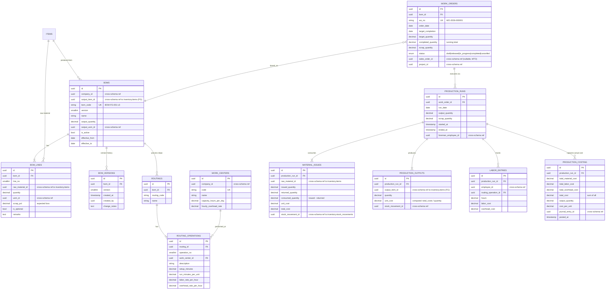

# Manufacturing Schema — `manufacturing.*`

**Purpose:** Bill of Materials (BOM), Work Orders, production runs, production costing, scrap/yield tracking.
**PFRS alignment:** PAS 2 Inventories — manufacturing costing standards.

---

## ERD



---

## Tables (summary)

| Table | Rows (est.) | Critical indexes | Notes |
|---|---|---|---|
| `boms` | ~500 | PK, UK(bom_code) | Multi-version per FG |
| `bom_versions` | ~3 per BOM | PK, idx(bom_id, version) | |
| `bom_lines` | ~10 per BOM | PK, idx(bom_id, line_no) | |
| `routings` | ~500 | PK, UK(bom_id, routing_code) | |
| `routing_operations` | ~5 per routing | PK, idx(routing_id, operation_no) | |
| `work_centers` | ~20 | PK, UK(code) | |
| `work_orders` | ~5k/year | PK, UK(wo_no), idx(bom_id, status), idx(project_id) | |
| `production_runs` | ~10k/year | PK, idx(work_order_id, run_date) | |
| `material_issues` | ~50k/year | PK, idx(production_run_id) | |
| `production_outputs` | ~10k/year | PK, idx(production_run_id) | |
| `labor_entries` | ~100k/year | PK, idx(production_run_id, employee_id) | |
| `production_costing` | 1 per run | PK, UK(production_run_id) | Posted to GL |

---

## Costing Flow

On each `production_run` completion:

```
1. Material cost   = SUM(material_issues.consumed_quantity × moving_avg_cost)
2. Labor cost      = SUM(labor_entries.hours × labor_rate_per_hour)
3. Overhead cost   = SUM(labor_entries.hours × overhead_rate_per_hour)
4. Total cost      = material + labor + overhead
5. Unit cost       = total_cost / output_quantity
```

Posted as JV:
- DR `Finished Goods Inventory` (output_quantity × unit_cost)
- DR `Manufacturing Variance` (if standard cost differs)
- CR `Raw Materials Inventory` (material cost)
- CR `Direct Labor` (labor)
- CR `Manufacturing Overhead Applied` (overhead)

`PostProductionCostingController` is a single-action invokable controller.

---

## Cross-Schema References

**Outbound:**
- `boms.output_item_id`, `bom_lines.raw_material_id` → `inventory.items.id`
- `material_issues.stock_movement_id` → `inventory.stock_movements.id`
- `production_outputs.stock_movement_id` → `inventory.stock_movements.id`
- `labor_entries.employee_id` → `hr.employees.id`
- `production_costing.journal_entry_id` → `accounting.journal_entries.id`
- `work_orders.sales_order_id` → `sales.sales_orders.id`
- `work_orders.project_id` → `projects.projects.id`

**Inbound:**
- `inventory.stock_movements` consumes raw materials, produces FG
- `accounting.journal_entries` records the costing
