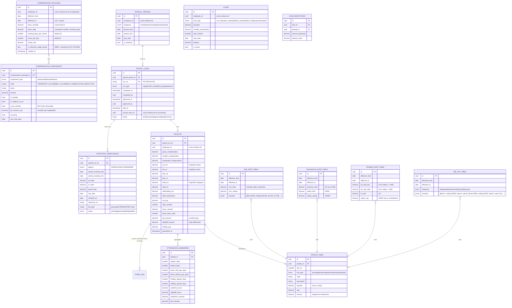

# Payroll Schema — `payroll.*`

**Purpose:** Compensation packages, payroll runs, payslips, statutory deductions (SSS, PhilHealth, Pag-IBIG, BIR), 13th month pay, leave conversions.
**BIR alignment:** Form 1601-C (monthly compensation WT), Form 2316 (annual cert), Form 1604-CF (annual alphalist of employees).
**Statutory:** SSS R-3/R-5, PhilHealth RF-1, Pag-IBIG MCRF.

---

## ERD



---

## Tables (summary)

| Table | Rows (est.) | Critical indexes | Notes |
|---|---|---|---|
| `compensation_packages` | ~1.5 per employee | PK, idx(employee_id, effective_from desc) | Versioned via effective dates |
| `compensation_components` | ~5 per package | PK, idx(compensation_package_id) | de minimis caps from RR 5-2011 |
| `payroll_periods` | ~24/year (semimonthly) | PK, UK(company_id, period_start, period_end) | |
| `payroll_runs` | ~24/year + bonuses | PK, UK(run_no) | |
| `payslips` | employees × periods | PK, UK(payroll_run_id, employee_id) | |
| `payslip_lines` | ~10 per payslip | PK, idx(payslip_id, line_no) | |
| `attendance_summaries` | 1 per payslip | PK, UK(payslip_id) | Aggregated from `hr.attendance` |
| `statutory_remittances` | 4 per period (SSS, PHIC, HDMF, BIR) | PK, idx(agency, period_covered_start) | |
| `sss_rate_table` | ~10 versions over time | PK, idx(effective_from desc) | Updated when SSS issues new circular |
| `philhealth_rate_table` | ~5 versions | PK, idx(effective_from desc) | |
| `pagibig_rate_table` | ~3 versions | PK, idx(effective_from desc) | |
| `bir_tax_table` | one per frequency × version | PK, UK(frequency, effective_from) | TRAIN Law brackets |
| `loans` | ~100 active | PK, idx(employee_id, is_active) | SSS/HDMF/company loans |
| `loan_deductions` | per payslip × active loan | PK, UK(loan_id, payslip_id) | |

---

## TRAIN Law Withholding Tax Computation (Compensation)

Per RA 10963 (TRAIN), updated brackets effective 2023+:

| Annual Taxable Income | Tax |
|---|---|
| ≤ ₱250,000 | 0 |
| ₱250,001 – ₱400,000 | 15% of excess over ₱250,000 |
| ₱400,001 – ₱800,000 | ₱22,500 + 20% of excess over ₱400,000 |
| ₱800,001 – ₱2,000,000 | ₱102,500 + 25% of excess over ₱800,000 |
| ₱2,000,001 – ₱8,000,000 | ₱402,500 + 30% of excess over ₱2,000,000 |
| > ₱8,000,000 | ₱2,202,500 + 35% of excess over ₱8,000,000 |

Engine: `Payroll\Domain\Services\WithholdingTaxCalculator` resolves the bracket via `bir_tax_table` and applies it per payroll frequency.

---

## SSS Computation (2025+ schedule)

Lookup `sss_rate_table.brackets` for the employee's MSC (Monthly Salary Credit). Each bracket has `ee` and `er` amounts. Total contribution = `ee + er + ec` (Employee Compensation).

## PhilHealth (2026)

`premium_rate × min(max(monthly_salary, floor), ceiling)`, split 50/50 EE/ER.
Floor: ₱10,000 → ₱500 total. Ceiling: ₱100,000 → ₱5,000 total. Rate: 5%.

## Pag-IBIG

EE: 1% if monthly salary ≤ ₱1,500, else 2%. ER: 2%. Cap: ₱10,000 base → max ₱200 EE + ₱200 ER.

---

## 13th Month Pay (PD 851)

Computed annually:
```
13th_month = SUM(basic_pay_received_during_year) / 12
```
Tax-exempt up to ₱90,000 (RR 11-2018); excess subject to WT.

Generated via dedicated `RunPayrollController` with `run_type='13th_month'` (single-action verb), separate from regular runs.

---

## Triggers

```sql
-- Audit on payroll approval (high-stakes)
CREATE TRIGGER payroll_runs_audit
    AFTER UPDATE OF status, approved_at, paid_at ON payroll.payroll_runs
    FOR EACH ROW EXECUTE FUNCTION audit.write_event('PayrollRun');

-- No DELETE on finalized payroll
REVOKE DELETE ON payroll.payroll_runs, payroll.payslips, payroll.payslip_lines FROM pha_app;
```

---

## Cross-Schema References

**Outbound:**
- `compensation_packages.employee_id` → `hr.employees.id`
- `payslips.employee_id` → `hr.employees.id`
- `payroll_runs.journal_entry_id` → `accounting.journal_entries.id`
- `attendance_summaries` reads from `hr.attendance` and `hr.leave_requests`

**Inbound:**
- `tax.form_2316.payslip_summary` ← annual aggregation
- `tax.alphalist_entries` (Schedule 7.1 Annual Alphalist of Employees) ← 1604-CF aggregation
