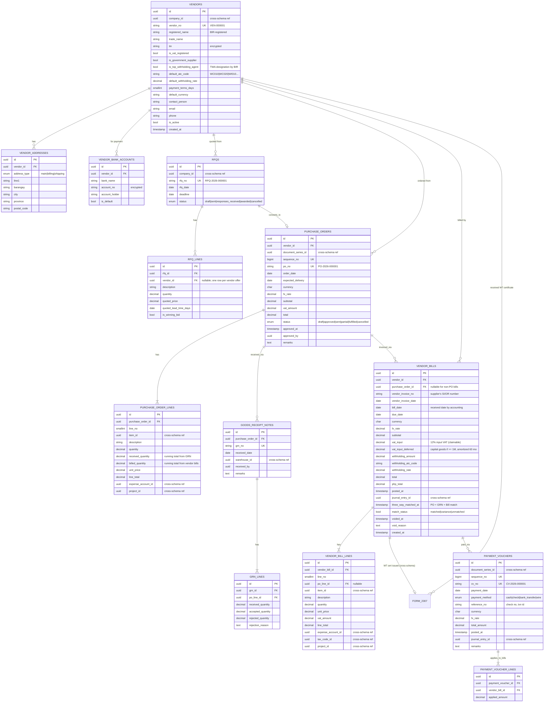

# Procurement Schema — `procurement.*`

**Purpose:** Vendors, RFQs, purchase orders, goods receipt notes (GRN), vendor bills, 3-way match.
**BIR alignment:** Form 2307 issuance to suppliers (withholding certificate), Purchases Book per CAS.

---

## ERD



---

## Tables (summary)

| Table | Rows (est.) | Critical indexes | Notes |
|---|---|---|---|
| `vendors` | ~500 | PK, UK(vendor_no), UK(tin) | TIN encrypted; `is_top_withholding_agent` from BIR list |
| `vendor_addresses` | ~1k | PK, idx(vendor_id) | |
| `vendor_bank_accounts` | ~600 | PK, idx(vendor_id) | Account # encrypted |
| `rfqs` | ~500/year | PK, UK(rfq_no) | |
| `rfq_lines` | ~3k/year | PK, idx(rfq_id, vendor_id) | |
| `purchase_orders` | ~5k/year | PK, UK(po_no), idx(vendor_id, order_date), idx(status) | |
| `purchase_order_lines` | ~20k/year | PK, idx(purchase_order_id, line_no) | `received_quantity` and `billed_quantity` updated by triggers |
| `goods_receipt_notes` | ~5k/year | PK, UK(grn_no), idx(purchase_order_id) | Triggers stock_movement insert |
| `grn_lines` | ~20k/year | PK, idx(grn_id, po_line_id) | |
| `vendor_bills` | ~10k/year | PK, UK(vendor_id, vendor_invoice_no), idx(vendor_id, bill_date), idx(posted_at), idx(match_status) | 3-way match status flagged |
| `vendor_bill_lines` | ~30k/year | PK, idx(vendor_bill_id) | |
| `payment_vouchers` | ~5k/year | PK, UK(cv_no), idx(payment_date) | |
| `payment_voucher_lines` | ~10k/year | PK, idx(vendor_bill_id) | |

---

## 3-Way Match Logic

A bill is `matched` when **all** are true (per line):
```
po.received_quantity ≥ bill.quantity   (cannot bill more than received)
po.unit_price        = bill.unit_price (or within tolerance %)
bill.quantity        = grn.accepted_quantity (referenced GRN)
```

Variance flags `match_status = 'variance'` and routes to Approver for override (logged in audit).
Bills with `purchase_order_id IS NULL` (direct bills, e.g. utilities) skip matching but require explicit approval.

---

## Withholding Tax Engine

On `vendor_bills.posted_at`:
1. Look up `vendor.default_atc_code` (or override at line level)
2. Look up rate from `tax.atc_codes`
3. Compute `withholding_amount = subtotal × rate` (excluding VAT)
4. Generate `tax.form_2307` row with:
   - `vendor_bill_id`, `vendor_id`, `atc_code`, `income_payment`, `tax_withheld`, `period_from/to`
5. PDF generated lazily on demand or in batch quarterly
6. Vendor receives 2307 PDF via email or download

---

## Triggers

### 1. PO line received quantity rollup
```sql
CREATE TRIGGER grn_line_po_rollup
    AFTER INSERT OR UPDATE OR DELETE ON procurement.grn_lines
    FOR EACH ROW EXECUTE FUNCTION procurement.recalc_po_received_qty();
```

### 2. Audit emission on bill posting
```sql
CREATE TRIGGER vendor_bills_audit
    AFTER INSERT OR UPDATE OF posted_at, voided_at ON procurement.vendor_bills
    FOR EACH ROW EXECUTE FUNCTION audit.write_event('VendorBill');
```

### 3. Stock movement on GRN
GRN insert triggers `inventory.stock_movements` insert with `movement_type='receipt'`.

---

## Cross-Schema References

**Outbound:**
- `vendor_bill_lines.item_id` → `inventory.items.id`
- `vendor_bill_lines.expense_account_id` → `accounting.accounts.id`
- `vendor_bill_lines.tax_code_id` → `accounting.tax_codes.id`
- `vendor_bills.journal_entry_id` → `accounting.journal_entries.id`
- `purchase_orders.document_series_id` → `accounting.document_series.id`

**Inbound:**
- `tax.form_2307.vendor_bill_id` ← issued certificate
- `inventory.stock_movements.source_doc_id` ← when GRN deducts stock
