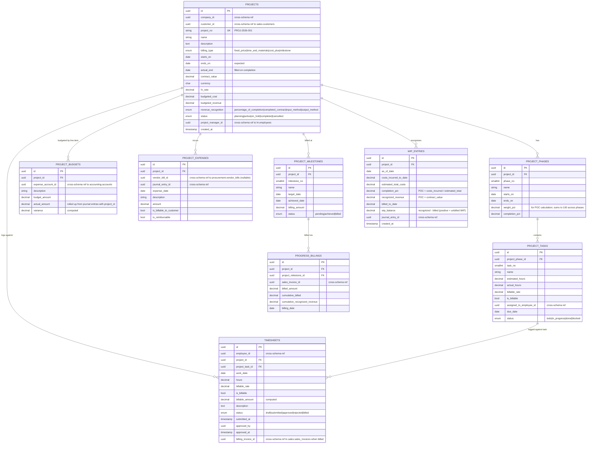

# Projects Schema — `projects.*`

**Purpose:** Project accounting, job costing, timesheets, billable hours, WIP recognition, project P&L.
**Use cases:** Construction, consulting, BPO, marketing agencies, professional services.
**PFRS alignment:** PFRS 15 Revenue from Contracts with Customers (percentage-of-completion or completed-contract).

---

## ERD



---

## Tables (summary)

| Table | Rows (est.) | Critical indexes | Notes |
|---|---|---|---|
| `projects` | ~100/year | PK, UK(project_no), idx(customer_id), idx(status) | |
| `project_phases` | ~5 per project | PK, idx(project_id, phase_no) | |
| `project_tasks` | ~50 per project | PK, idx(project_phase_id), idx(assigned_to_employee_id) | |
| `project_budgets` | ~10 per project | PK, idx(project_id, expense_account_id) | |
| `timesheets` | ~100k/year | PK, idx(employee_id, work_date), idx(project_id, work_date), idx(status) | |
| `project_expenses` | ~5k/year | PK, idx(project_id, expense_date) | |
| `project_milestones` | ~5 per project | PK, idx(project_id, milestone_no) | |
| `progress_billings` | ~5 per project | PK, idx(project_id, billing_date) | |
| `wip_entries` | monthly per active project | PK, idx(project_id, as_of_date desc) | Computed by month-end job |

---

## Revenue Recognition (PFRS 15)

### Percentage-of-Completion (default)
```
completion_pct = costs_incurred_to_date / estimated_total_costs
recognized_rev = completion_pct × contract_value
unbilled_wip   = recognized_rev - billed_to_date  (Asset)
billed_excess  = billed_to_date - recognized_rev  (Liability — Deferred Revenue)
```

Run by `RecognizeProjectRevenueController` (single-action) at month-end. Posts JV:
- DR `Construction in Progress / WIP Asset`
- CR `Project Revenue`

### Completed-Contract
Defer revenue and costs until project completion; on `actual_end` date, recognize all at once.

---

## Project P&L Report

```sql
SELECT
    p.id, p.name, p.contract_value AS revenue,
    SUM(pe.amount)                   AS direct_expenses,
    SUM(t.hours * t.billable_rate)   AS billable_labor,
    p.contract_value
        - SUM(pe.amount)
        - SUM(t.hours * COALESCE(emp.cost_rate, 0)) AS gross_profit
FROM projects.projects p
LEFT JOIN projects.project_expenses pe ON pe.project_id = p.id
LEFT JOIN projects.timesheets t        ON t.project_id = p.id
GROUP BY p.id;
```

(In production this becomes a materialized view in `reporting.*` refreshed nightly.)

---

## Cross-Schema References

**Outbound:**
- `projects.customer_id` → `sales.customers.id`
- `projects.project_manager_id` → `hr.employees.id`
- `project_budgets.expense_account_id` → `accounting.accounts.id`
- `timesheets.employee_id` → `hr.employees.id`
- `timesheets.billing_invoice_id` → `sales.sales_invoices.id`
- `project_expenses.vendor_bill_id` → `procurement.vendor_bills.id`
- `progress_billings.sales_invoice_id` → `sales.sales_invoices.id`
- `wip_entries.journal_entry_id` → `accounting.journal_entries.id`

**Inbound:**
- `accounting.journal_lines.project_id` ← every JE line can be tagged to a project
- `sales.sales_invoice_lines.project_id` ← invoice lines may be project-tagged
