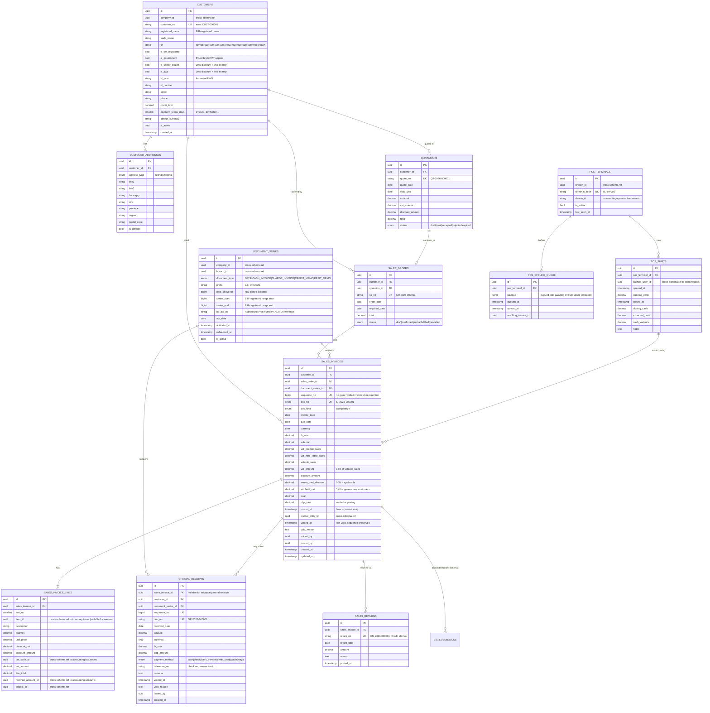

# Sales Schema — `sales.*`

**Purpose:** Customers, sales invoices (SI), official receipts (OR), POS terminals, document series for BIR sequential numbering, sales returns.
**Owned by role:** `pha_app`
**BIR alignment:** RR 18-2012 (OR/SI), RR 8-2022 (EIS), RR 9-2009 (CAS sequential numbering)

---

## ERD



---

## Tables (summary)

| Table | Rows (est.) | Critical indexes | Notes |
|---|---|---|---|
| `customers` | 100–10k | PK, UK(customer_no), UK(tin) where not null, idx(company_id, is_active) | TIN encrypted via pgcrypto |
| `customer_addresses` | ~2 per customer | PK, idx(customer_id) | Region/province use PSGC codes |
| `quotations` | ~5k/year | PK, UK(quote_no) | |
| `sales_orders` | ~5k/year | PK, UK(so_no), idx(customer_id, order_date) | |
| `document_series` | ~20 (per branch × type) | PK, UK(company_id, branch_id, document_type, prefix) | **BIR-critical** — see invariants |
| `sales_invoices` | ~50k/year | PK, UK(doc_no), UK(document_series_id, sequence_no), idx(customer_id, invoice_date), idx(posted_at) | Partition by RANGE(invoice_date) yearly when > 500k |
| `sales_invoice_lines` | ~150k/year | PK, idx(sales_invoice_id, line_no), idx(item_id) | |
| `official_receipts` | ~50k/year | PK, UK(doc_no), UK(document_series_id, sequence_no) | |
| `sales_returns` | ~500/year | PK, UK(return_no) | Credit memo |
| `pos_terminals` | ~20 | PK, UK(terminal_code) | |
| `pos_shifts` | ~6k/year (terminals × days) | PK, idx(pos_terminal_id, opened_at) | Cash variance reporting |
| `pos_offline_queue` | transient | PK, idx(pos_terminal_id, queued_at) where synced_at is null | Cleared on sync |

---

## Triggers (BIR-critical)

### 1. Sequential numbering allocator
```sql
CREATE OR REPLACE FUNCTION sales.allocate_doc_no(_series_id uuid)
    RETURNS bigint
    LANGUAGE plpgsql AS $$
DECLARE _seq bigint;
BEGIN
    -- Row-lock the series; SERIALIZABLE isolation in caller transaction
    SELECT next_sequence INTO _seq
      FROM sales.document_series
     WHERE id = _series_id
       FOR UPDATE;

    UPDATE sales.document_series
       SET next_sequence = next_sequence + 1,
           exhausted_at = CASE WHEN next_sequence + 1 > series_end THEN now() ELSE exhausted_at END
     WHERE id = _series_id;

    IF _seq > (SELECT series_end FROM sales.document_series WHERE id = _series_id) THEN
        RAISE EXCEPTION 'Document series exhausted; new BIR ATP required';
    END IF;

    RETURN _seq;
END $$;
```

### 2. Void preserves sequence (no DELETE)
```sql
REVOKE DELETE ON sales.sales_invoices, sales.official_receipts FROM pha_app;
-- Voiding sets voided_at; sequence_no remains in place. BIR auditor sees
-- the void reason and the gap-free sequence.
```

### 3. EIS transmission trigger (async)
```sql
CREATE TRIGGER sales_invoice_eis_dispatch
    AFTER UPDATE OF posted_at ON sales.sales_invoices
    FOR EACH ROW
    WHEN (NEW.posted_at IS NOT NULL AND OLD.posted_at IS NULL)
    EXECUTE FUNCTION tax.enqueue_eis_submission();
```

(The function inserts a `tax.eis_submissions` row in `pending` status; a Horizon job picks it up.)

---

## Senior Citizen / PWD Discount Logic

Per RA 9994 (Senior) and RA 10754 (PWD): 20% discount on selected goods/services, **plus** VAT exemption on the discounted amount.

Application in `sales_invoices`:
```
gross           = qty × unit_price                        (per line)
sc_pwd_discount = gross × 0.20    (if customer.is_senior_citizen OR is_pwd)
net_of_discount = gross - sc_pwd_discount
vat_amount      = 0                (VAT exempt for senior/PWD)
total           = net_of_discount
```

For mixed customers (some lines eligible, some not), discount is line-level not invoice-level.

---

## Cross-Schema References

**Outbound:**
- `sales_invoices.journal_entry_id` → `accounting.journal_entries.id`
- `sales_invoice_lines.item_id` → `inventory.items.id`
- `sales_invoice_lines.tax_code_id` → `accounting.tax_codes.id`
- `sales_invoice_lines.revenue_account_id` → `accounting.accounts.id`
- `sales_invoice_lines.project_id` → `projects.projects.id`

**Inbound:**
- `tax.eis_submissions.sales_invoice_id` ← (consumed by EIS gateway)
- `inventory.stock_movements.source_doc_id` ← when sale deducts stock
- `accounting.journal_entries.source_doc_id` ← when invoice posts
