# Tax Schema — `tax.*`

**Purpose:** Tax codes, ATC (Alphanumeric Tax Code) codes, BIR forms generation, withholding certificates (2307), 2316, alphalist, EIS submissions.
**This is the highest-stakes schema for BIR compliance.**

**BIR alignment:**
- RR 2-98 / RR 11-2018 (withholding tax)
- RR 16-2005 (VAT regulations)
- RR 8-2022, RR 6-2024 (EIS — e-Invoicing System)
- RR 9-2009, RR 11-2025 (CAS)
- RMO 12-2013 (e-Sales reporting)
- RA 10963 TRAIN Law (income tax brackets)

---

## ERD

```mermaid
erDiagram
    TAX_CODES ||--o{ ATC_CODES : "withholding subset"
    TAX_CODES ||--o{ TAX_RATE_HISTORY : versioned
    BIR_FORMS ||--o{ BIR_FORM_LINES : "line-level data"
    BIR_FORMS ||--o{ BIR_FORM_ATTACHMENTS : has
    BIR_FORMS ||--o{ ALPHALIST_ENTRIES : aggregates
    BIR_FORMS ||--o{ FORM_FILING_LOG : "filing history"
    SALES_INVOICES ||--o{ EIS_SUBMISSIONS : "transmits (cross-schema)"
    EIS_SUBMISSIONS ||--o{ EIS_RETRIES : "retry log"
    VENDOR_BILLS ||--o{ FORM_2307 : "WT cert (cross-schema)"
    FORM_2307 }o--|| ALPHALIST_ENTRIES : "feeds SAWT/QAP/MAP"
    PAYSLIPS ||--o{ FORM_2316 : "annual cert (cross-schema)"
    FORM_2316 }o--|| ALPHALIST_ENTRIES : "feeds 1604-CF Sched 7.1"
    BIR_CERTIFICATE ||--o{ EIS_SUBMISSIONS : signs

    TAX_CODES {
        uuid id PK
        string code UK "VAT-12|VAT-0|VAT-EX|VAT-WHELD-GOV"
        string name
        decimal rate
        enum kind "vat_output|vat_input|vat_exempt|vat_zero|withholding|excise|percentage"
        string description
        date effective_from
        date effective_to
        uuid replaced_by_id FK
    }
    TAX_RATE_HISTORY {
        uuid id PK
        uuid tax_code_id FK
        decimal rate
        date effective_from
        date effective_to
        string regulation_ref "RR 8-2022, etc."
    }
    ATC_CODES {
        uuid id PK
        uuid tax_code_id FK
        string code UK "WC010|WC020|WC100|WI010|WI011|WI012|WI070|WV010|WV020|WB070..."
        string description
        decimal rate
        enum kind "expanded|final|compensation|government|fringe_benefit|vat_withheld"
        date effective_from
        date effective_to
    }
    BIR_FORMS {
        uuid id PK
        uuid company_id "cross-schema ref"
        enum form_type "2550M|2550Q|1601C|1601EQ|1601FQ|0619E|0619F|1701|1701A|1702RT|1702EX|2316|1604CF|1604E|1604F|2000-OT"
        date period_from
        date period_to
        smallint year
        smallint quarter "for quarterly forms"
        smallint month "for monthly forms"
        jsonb data "computed line values; matches eBIRForms structure"
        string xml_path "eBIRForms-compatible XML in MinIO"
        string pdf_path
        string dat_path "for alphalist DAT"
        timestamp generated_at
        uuid generated_by
        timestamp filed_at
        string bir_filing_ref
        decimal tax_due
        decimal tax_paid
        enum status "draft|generated|filed|paid|amended"
        uuid replaced_by_id FK "for amended returns"
    }
    BIR_FORM_LINES {
        uuid id PK
        uuid bir_form_id FK
        string line_code "1A|1B|2|3|4A|...; matches BIR form line codes"
        string description
        decimal amount
        jsonb breakdown
    }
    BIR_FORM_ATTACHMENTS {
        uuid id PK
        uuid bir_form_id FK
        enum attachment_type "SAWT|QAP|MAP|alphalist|inventory_list|supporting_doc"
        string file_path
        string file_format "DAT|CSV|PDF|XML"
        timestamp generated_at
    }
    ALPHALIST_ENTRIES {
        uuid id PK
        uuid bir_form_id FK
        enum schedule "1|2|3|4|5|6|7_1|7_2|7_3|7_4"
        string tin "format: 000-000-000-000"
        string registered_name
        string atc_code
        decimal nature_of_payment
        decimal income_payment
        decimal tax_withheld
        char tax_type "I|F|C"
        date payment_date
    }
    FORM_FILING_LOG {
        bigint id PK
        uuid bir_form_id FK
        timestamp attempted_at
        enum channel "ebirforms_offline|ebirforms_online|efps|manual"
        enum result "pending|success|failure|amended"
        string ack_no
        text response
        text error
    }
    EIS_SUBMISSIONS {
        uuid id PK
        uuid sales_invoice_id "cross-schema ref"
        uuid bir_certificate_id FK
        jsonb payload "BIR EIS JSON schema"
        bytea signature "X.509 detached signature (PKCS#7)"
        string qr_url "BIR portal URL embedded in QR"
        string qr_image_path
        string bir_ack_no
        enum status "pending|submitting|acknowledged|rejected|failed"
        smallint retry_count
        timestamp submitted_at
        timestamp acknowledged_at
        text rejection_reason
    }
    EIS_RETRIES {
        bigint id PK
        uuid eis_submission_id FK
        timestamp attempted_at
        smallint http_status
        text response_body
        text error_message
    }
    BIR_CERTIFICATE {
        uuid id PK
        string subject "CN=COMPANY NAME, O=..."
        string serial_no
        date valid_from
        date valid_to
        string p12_path "encrypted P12 cert in MinIO"
        bool is_active
    }
    FORM_2307 {
        uuid id PK
        uuid vendor_bill_id "cross-schema ref"
        uuid vendor_id "cross-schema ref"
        string atc_code
        decimal income_payment
        decimal tax_withheld
        date period_from
        date period_to
        string pdf_path
        timestamp issued_at
        uuid issued_by
        bool sent_to_vendor
        timestamp sent_at
    }
    FORM_2316 {
        uuid id PK
        uuid employee_id "cross-schema ref"
        smallint tax_year
        decimal gross_compensation
        decimal nontaxable_compensation
        decimal taxable_compensation
        decimal tax_withheld
        decimal tax_due
        decimal tax_refund_due
        string pdf_path
        timestamp issued_at
        timestamp signed_at
    }
    EFPS_BANK_TRANSACTIONS {
        uuid id PK
        uuid bir_form_id FK
        string bank_code
        decimal amount
        date transaction_date
        string reference_no
    }
```



---

## Tables (summary)

| Table | Rows (est.) | Critical indexes | Notes |
|---|---|---|---|
| `tax_codes` | ~30 | PK, UK(code) | Seeded; versioned via effectivity |
| `tax_rate_history` | ~50 | PK, idx(tax_code_id, effective_from desc) | Audit trail of regulation changes |
| `atc_codes` | ~80 | PK, UK(code) | All BIR ATC codes |
| `bir_forms` | ~50/year | PK, UK(company_id, form_type, period_from, period_to), idx(status) | One per period per type |
| `bir_form_lines` | ~30 per form | PK, idx(bir_form_id, line_code) | |
| `bir_form_attachments` | ~3 per form | PK, idx(bir_form_id) | |
| `alphalist_entries` | ~10k/year | PK, idx(bir_form_id, schedule), idx(tin) | Aggregated for 1604-CF, 1604-E, SAWT, QAP, MAP |
| `form_filing_log` | ~100/year | PK, idx(bir_form_id, attempted_at) | |
| `eis_submissions` | ~50k/year | PK, UK(sales_invoice_id), idx(status, submitted_at) | One per invoice |
| `eis_retries` | ~5k/year | PK, idx(eis_submission_id, attempted_at) | |
| `bir_certificate` | 1–2 active | PK | X.509 cert for EIS signing |
| `form_2307` | ~10k/year | PK, idx(vendor_id, period_from), idx(vendor_bill_id) | One per WT transaction |
| `form_2316` | employees count × years | PK, UK(employee_id, tax_year) | Annual cert |
| `efps_bank_transactions` | ~50/year | PK, idx(bir_form_id) | EFPS payment trail |

---

## Seeded ATC Codes (Sample)

| Code | Description | Rate | Kind |
|---|---|---|---|
| WC010 | Compensation — citizens & resident aliens | per BIR table | compensation |
| WI010 | Professionals — individual | 5/10% | expanded |
| WI011 | Professional fees — corporate | 10/15% | expanded |
| WI012 | Professional/talent fees — corporate (TWA) | 15% | expanded |
| WC100 | Top 20,000 individual taxpayer payor | 1% | expanded |
| WC158 | Income payments to certain contractors | 2% | expanded |
| WI070 | Rentals — real property | 5% | expanded |
| WI080 | Rentals — personal property | 5% | expanded |
| WV010 | VAT withheld — purchases of goods (gov) | 5% | vat_withheld |
| WV020 | VAT withheld — purchases of services (gov) | 5% | vat_withheld |
| WB070 | Final WT — interest on bank deposits | 20% | final |

Full seed file: `database/seed-data/atc-codes.json` (80+ codes from BIR).

---

## EIS Submission Flow

```
1. SalesInvoice.posted_at set
2. AFTER UPDATE trigger inserts tax.eis_submissions row (status='pending')
3. Horizon job 'TransmitEisSubmissionJob' (queue: eis-priority) picks it up:
   a. Build canonical JSON per BIR EIS schema
   b. Sign with X.509 cert (bir_certificate.p12_path)
   c. Generate QR code → store in MinIO
   d. POST to BIR EIS API (configured via BIR_EIS_BASE_URL)
   e. On 2xx: store ack_no, status='acknowledged', notify subscribers
   f. On 4xx (rejected): status='rejected', alert finance
   g. On 5xx/timeout: log retry to eis_retries, exponential backoff (5m, 30m, 2h, 12h)
4. Max retry duration BIR_EIS_RETRY_MAX_HOURS (default 24h); after that → manual intervention
```

The QR code on each invoice's printed copy links to the BIR portal (e.g. `https://eis.bir.gov.ph/invoice/<ack_no>`).

---

## BIR Forms Generation Pipeline

Each form has a single-action controller (`GenerateForm2550MController`, etc.) that:
1. Queries source data (sales/purchases/payroll for the period)
2. Maps to BIR line codes per the form's spec
3. Inserts `bir_forms` + `bir_form_lines` rows
4. Generates eBIRForms-compatible XML and PDF
5. For forms with attachments, generates DAT files (SAWT, QAP, MAP, alphalist)
6. Stores all files in MinIO with deterministic paths: `bir/{tin}/{year}/{form_type}/{period}/{filename}`

**Filing channels:**
- `ebirforms_offline` — generated XML/PDF imported into BIR's eBIRForms package
- `efps` — direct e-filing for large taxpayers (via BIR API)

---

## Cross-Schema References

**Outbound:**
- `eis_submissions.sales_invoice_id` → `sales.sales_invoices.id`
- `form_2307.vendor_bill_id` → `procurement.vendor_bills.id`
- `form_2307.vendor_id` → `procurement.vendors.id`
- `form_2316.employee_id` → `hr.employees.id`

**Inbound:**
- `accounting.journal_lines.tax_code_id` ← every taxable line tags a code
- `sales.sales_invoice_lines.tax_code_id` ← VAT/exempt/zero classification
- `procurement.vendor_bill_lines.tax_code_id` ← input VAT classification
