# Philippine Accounting System — Master Database ERD

**Database:** `accountingdb` (PostgreSQL 16)
**Strategy:** One database, one schema per bounded context. Cross-schema references use UUIDs and are **never** joined directly across modules in application code — traversal goes through Application/Contracts.

This document is the **source of truth** for the database structure. Per-schema details live next to this file (`erd-identity.md`, `erd-accounting.md`, etc.). Diagrams render natively in GitHub and VS Code (Mermaid Preview extension).

---

## 1. Schema Map (Bird's-Eye View)

```
                           ┌─────────────────────────┐
                           │   accountingdb (PG 16)  │
                           └────────────┬────────────┘
                                        │
   ┌───────────┬───────────┬───────────┼───────────┬───────────┬───────────┐
   ▼           ▼           ▼           ▼           ▼           ▼           ▼
┌────────┐ ┌─────────┐ ┌──────┐ ┌──────────┐ ┌───────────┐ ┌──────┐ ┌──────────┐
│identity│ │accounting│ │sales │ │inventory │ │procurement│ │payroll│ │   tax    │
└───┬────┘ └────┬────┘ └──┬───┘ └────┬─────┘ └─────┬─────┘ └──┬───┘ └────┬─────┘
    │           │         │          │             │          │          │
    │           ▼         ▼          ▼             ▼          ▼          │
    │      ┌────────────────────────────────────────────────────┐        │
    │      │    FK boundaries cross schemas via UUIDs            │        │
    │      │    ── NEVER joined directly across modules ──       │        │
    │      │    ── traversed only via Application/Contracts ──   │        │
    │      └────────────────────────────────────────────────────┘        │
    │                                                                    │
    └────────► identity.companies ──────► all other modules (company_id) ◄┘

┌────┐ ┌──────────┐ ┌──────────────┐ ┌──────────┐
│ hr │ │ projects │ │manufacturing │ │reporting │ ◄── read-mostly (uses pha_reader role)
└────┘ └──────────┘ └──────────────┘ └──────────┘
                                            ▲
                                            │
                                       ┌────┴────┐
                                       │  audit  │  ◄── append-only, hash-chained
                                       └─────────┘     (pha_audit role; UPDATE/DELETE revoked)
```

| Schema | Owned by | Purpose | Read role |
|---|---|---|---|
| `identity` | `pha_app` | Companies, branches, users, roles, permissions, MFA | `pha_app`, `pha_reader` |
| `accounting` | `pha_app` | Chart of Accounts, journal entries, fiscal periods, FX | `pha_app`, `pha_reader` |
| `sales` | `pha_app` | Customers, sales invoices, official receipts, POS, document series | `pha_app`, `pha_reader` |
| `inventory` | `pha_app` | Items, warehouses, stock movements, costing | `pha_app`, `pha_reader` |
| `procurement` | `pha_app` | Vendors, purchase orders, vendor bills, 3-way match | `pha_app`, `pha_reader` |
| `payroll` | `pha_app` | Compensation, payroll runs, payslips, statutory deductions | `pha_app`, `pha_reader` |
| `hr` | `pha_app` | Employees, leave, attendance | `pha_app`, `pha_reader` |
| `projects` | `pha_app` | Projects, timesheets, WIP, project P&L | `pha_app`, `pha_reader` |
| `manufacturing` | `pha_app` | BOM, work orders, production runs | `pha_app`, `pha_reader` |
| `tax` | `pha_app` | Tax codes, ATC codes, BIR forms, 2307, alphalist, EIS | `pha_app`, `pha_reader` |
| `reporting` | `pha_app` | Materialized views, report runs | `pha_reader` (mostly) |
| `audit` | `pha_audit` | Hash-chained immutable event log | INSERT-only via `pha_audit`; SELECT via `pha_reader` |

---

## 2. Master ERD — Cross-Schema Relationships

```mermaid
erDiagram
    COMPANIES ||--o{ BRANCHES : has
    COMPANIES ||--o{ USERS : employs
    COMPANIES ||--o{ FISCAL_YEARS : owns
    FISCAL_YEARS ||--o{ FISCAL_PERIODS : contains
    COMPANIES ||--o{ ACCOUNTS : "Chart of Accounts"
    ACCOUNTS ||--o{ ACCOUNTS : "parent/child (ltree)"

    FISCAL_PERIODS ||--o{ JOURNAL_ENTRIES : posts_within
    JOURNAL_ENTRIES ||--|{ JOURNAL_LINES : has
    ACCOUNTS ||--o{ JOURNAL_LINES : debited_credited
    TAX_CODES ||--o{ JOURNAL_LINES : may_carry
    FX_RATES ||--o{ JOURNAL_LINES : converted_at

    COMPANIES ||--o{ CUSTOMERS : owns
    CUSTOMERS ||--o{ SALES_INVOICES : billed
    DOCUMENT_SERIES ||--o{ SALES_INVOICES : numbers
    SALES_INVOICES ||--o{ OFFICIAL_RECEIPTS : "may collect"
    SALES_INVOICES ||--|| JOURNAL_ENTRIES : posted_as
    SALES_INVOICES ||--o{ EIS_SUBMISSIONS : transmitted_to_BIR

    COMPANIES ||--o{ VENDORS : transacts
    VENDORS ||--o{ VENDOR_BILLS : invoices
    VENDOR_BILLS ||--o{ FORM_2307 : issues_certificate
    VENDOR_BILLS ||--|| JOURNAL_ENTRIES : posted_as
    PURCHASE_ORDERS ||--o{ VENDOR_BILLS : matches_3way

    COMPANIES ||--o{ ITEMS : stocks
    ITEMS ||--o{ STOCK_MOVEMENTS : tracks
    WAREHOUSES ||--o{ STOCK_MOVEMENTS : at
    SALES_INVOICES ||--o{ STOCK_MOVEMENTS : "deducts (sale)"
    VENDOR_BILLS ||--o{ STOCK_MOVEMENTS : "adds (receipt)"

    COMPANIES ||--o{ EMPLOYEES : employs
    EMPLOYEES ||--o{ COMPENSATION_PACKAGES : has
    PAYROLL_RUNS ||--|{ PAYSLIP_LINES : contains
    EMPLOYEES ||--o{ PAYSLIP_LINES : paid
    PAYROLL_RUNS ||--|| JOURNAL_ENTRIES : posted_as

    COMPANIES ||--o{ PROJECTS : runs
    EMPLOYEES ||--o{ TIMESHEETS : logs
    PROJECTS ||--o{ TIMESHEETS : billed_to

    TAX_CODES ||--o{ ATC_CODES : "withholding subset"
    BIR_FORMS ||--o{ ALPHALIST_ENTRIES : aggregates
    FORM_2307 }o--|| ALPHALIST_ENTRIES : "feeds SAWT/QAP"

    AUDIT_EVENTS }o--|| COMPANIES : scoped_to
    AUDIT_EVENTS }o--|| AUDIT_EVENTS : "hash chain (prev_hash)"

    COMPANIES {
        uuid id PK
        string tin
        string rdo_code
        string registered_name
        string trade_name
        enum taxpayer_type
    }
    BRANCHES {
        uuid id PK
        uuid company_id FK
        string code
        string address
        string bir_branch_code
    }
    USERS {
        uuid id PK
        uuid company_id FK
        string email
        string password_hash
        bool mfa_enabled
    }
    FISCAL_YEARS {
        uuid id PK
        uuid company_id FK
        date starts_on
        date ends_on
        timestamp closed_at
    }
    FISCAL_PERIODS {
        uuid id PK
        uuid fiscal_year_id FK
        date starts_on
        date ends_on
        timestamp locked_at
        uuid locked_by
    }
    ACCOUNTS {
        uuid id PK
        uuid company_id FK
        uuid parent_id FK
        string code
        string name
        enum type
        enum normal_balance
        ltree path
        bool is_postable
    }
    JOURNAL_ENTRIES {
        uuid id PK
        uuid company_id FK
        uuid fiscal_period_id FK
        uuid document_series_id FK
        bigint sequence_no
        string doc_no
        date entry_date
        text memo
        timestamp posted_at
        uuid posted_by
        uuid reversed_by
    }
    JOURNAL_LINES {
        uuid id PK
        uuid journal_entry_id FK
        uuid account_id FK
        uuid tax_code_id FK
        char currency
        decimal debit
        decimal credit
        decimal fx_rate
        decimal php_amount
        uuid project_id
        uuid cost_center_id
    }
    FX_RATES {
        uuid id PK
        date rate_date
        char from_ccy
        char to_ccy
        decimal rate
        string source
    }
    TAX_CODES {
        uuid id PK
        string code
        string name
        decimal rate
        enum kind
        date effective_from
        date effective_to
    }
    ATC_CODES {
        uuid id PK
        uuid tax_code_id FK
        string code
        string description
        decimal rate
    }
    CUSTOMERS {
        uuid id PK
        uuid company_id FK
        string tin
        string registered_name
        string address
        bool is_vat_registered
        bool is_government
    }
    DOCUMENT_SERIES {
        uuid id PK
        uuid company_id FK
        uuid branch_id FK
        enum document_type
        string prefix
        bigint next_sequence
        bigint series_start
        bigint series_end
        string bir_atp_no
    }
    SALES_INVOICES {
        uuid id PK
        uuid customer_id FK
        uuid document_series_id FK
        bigint sequence_no
        string doc_no
        date invoice_date
        decimal subtotal
        decimal vat_amount
        decimal total
        timestamp voided_at
        text void_reason
    }
    OFFICIAL_RECEIPTS {
        uuid id PK
        uuid sales_invoice_id FK
        uuid document_series_id FK
        bigint sequence_no
        string doc_no
        date received_date
        decimal amount
    }
    EIS_SUBMISSIONS {
        uuid id PK
        uuid sales_invoice_id FK
        jsonb payload
        bytea signature
        string qr_url
        string bir_ack_no
        timestamp submitted_at
        enum status
        int retry_count
    }
    VENDORS {
        uuid id PK
        uuid company_id FK
        string tin
        string registered_name
        bool is_vat_registered
        string default_atc_code
    }
    PURCHASE_ORDERS {
        uuid id PK
        uuid vendor_id FK
        uuid document_series_id FK
        bigint sequence_no
        date order_date
        decimal total
        enum status
    }
    VENDOR_BILLS {
        uuid id PK
        uuid vendor_id FK
        uuid purchase_order_id FK
        string vendor_invoice_no
        date bill_date
        decimal subtotal
        decimal vat_input
        decimal withholding_amount
        decimal total
    }
    FORM_2307 {
        uuid id PK
        uuid vendor_bill_id FK
        uuid vendor_id FK
        string atc_code
        decimal income_payment
        decimal tax_withheld
        date period_from
        date period_to
        string pdf_path
    }
    ITEMS {
        uuid id PK
        uuid company_id FK
        string sku
        string name
        enum costing_method
        decimal moving_avg_cost
        bool is_inventory
    }
    WAREHOUSES {
        uuid id PK
        uuid company_id FK
        uuid branch_id FK
        string code
        string name
    }
    STOCK_MOVEMENTS {
        uuid id PK
        uuid item_id FK
        uuid warehouse_id FK
        enum movement_type
        decimal quantity
        decimal unit_cost
        uuid source_doc_id
        string source_doc_type
        timestamp moved_at
    }
    EMPLOYEES {
        uuid id PK
        uuid company_id FK
        string tin
        string sss_no
        string philhealth_no
        string pagibig_no
        string full_name
        date hired_on
        date separated_on
    }
    COMPENSATION_PACKAGES {
        uuid id PK
        uuid employee_id FK
        decimal basic_monthly
        decimal allowances_taxable
        decimal allowances_nontaxable
        date effective_from
    }
    PAYROLL_RUNS {
        uuid id PK
        uuid company_id FK
        date period_start
        date period_end
        enum status
        timestamp approved_at
    }
    PAYSLIP_LINES {
        uuid id PK
        uuid payroll_run_id FK
        uuid employee_id FK
        decimal gross
        decimal sss_ee
        decimal phic_ee
        decimal hdmf_ee
        decimal withholding_tax
        decimal net_pay
    }
    PROJECTS {
        uuid id PK
        uuid company_id FK
        uuid customer_id
        string code
        string name
        enum billing_type
        date starts_on
        date ends_on
    }
    TIMESHEETS {
        uuid id PK
        uuid employee_id FK
        uuid project_id FK
        date work_date
        decimal hours
        decimal billable_rate
    }
    BIR_FORMS {
        uuid id PK
        uuid company_id FK
        enum form_type
        date period_from
        date period_to
        jsonb data
        string xml_path
        string pdf_path
        timestamp generated_at
        timestamp filed_at
    }
    ALPHALIST_ENTRIES {
        uuid id PK
        uuid bir_form_id FK
        string tin
        string name
        decimal income
        decimal tax_withheld
        string atc_code
    }
    AUDIT_EVENTS {
        bigint id PK
        timestamp occurred_at
        uuid actor_id
        uuid company_id
        string event_type
        string aggregate
        uuid aggregate_id
        jsonb payload
        bytea prev_hash
        bytea current_hash
    }
```



---

## 3. Core Invariants Enforced at the Database Level

These invariants are **non-negotiable for BIR CAS compliance** and are enforced via Postgres triggers + permissions, not just application logic:

| Invariant | Enforcement |
|---|---|
| Locked fiscal periods reject writes | Trigger `accounting.reject_locked_period_writes` BEFORE INSERT/UPDATE on `journal_entries` |
| Sequential numbering, no gaps | Row-locked `next_sequence` on `sales.document_series` allocator |
| Voids preserve numbers | Soft-void via `voided_at` timestamp; sequence not reused |
| Financial rows cannot be deleted | `REVOKE DELETE` on `accounting.*`, `sales.*`, `tax.*` from `pha_app` |
| Audit log is immutable | `audit.events` triggers block UPDATE/DELETE; INSERT computes hash chain |
| Double-entry balance | Deferred constraint on `journal_lines`: `SUM(debit) = SUM(credit)` per entry, evaluated at COMMIT |
| TIN, SSS, PhilHealth, HDMF, bank# encrypted | `pgcrypto` column-level encryption on PII |
| 10-year retention (BIR-mandated) | Lifecycle policy on MinIO bucket `pha-documents`; no DELETE on financial tables ever |

---

## 4. Per-Schema Detail Diagrams

Each bounded context has its own ERD with full column-level detail, indexes, and constraints:

- [identity ERD](erd-identity.md) — companies, branches, users, roles
- [accounting ERD](erd-accounting.md) — CoA, journals, periods, FX, cost centers
- [sales ERD](erd-sales.md) — customers, invoices, OR, document series
- [inventory ERD](erd-inventory.md) — items, warehouses, stock movements
- [procurement ERD](erd-procurement.md) — vendors, POs, vendor bills
- [payroll ERD](erd-payroll.md) — compensation, payroll runs, payslips
- [hr ERD](erd-hr.md) — employees, leave, attendance
- [projects ERD](erd-projects.md) — projects, timesheets, WIP
- [manufacturing ERD](erd-manufacturing.md) — BOM, work orders, production
- [tax ERD](erd-tax.md) — tax codes, ATC, BIR forms, 2307, EIS
- [audit ERD](erd-audit.md) — hash-chained event log

---

## 5. Tooling & Maintenance

- **Source of truth**: this Markdown file + sibling `erd-*.md` files. Edited as text, reviewed in PRs.
- **Rendered output**: `mmdc` (Mermaid CLI) generates PNG/SVG into `rendered/` in CI (`.github/workflows/docs.yml`).
- **Auto-sync check**: a CI job runs `schemacrawler` against the dev database and diffs the live schema against these diagrams; PR fails if a migration adds an undocumented table or column.
- **VS Code rendering**: install the [Mermaid Preview](https://marketplace.visualstudio.com/items?itemName=bierner.markdown-mermaid) extension for inline preview while editing.
- **GitHub rendering**: Mermaid blocks render natively in GitHub web UI without extra setup.

---

**Cross-references:** See the [architecture plan](../../../../.claude/plans/act-as-senior-system-wild-spring.md) §4 and §5 for the design rationale, and `database/init.sql` for the cluster bootstrap script that creates these schemas.
